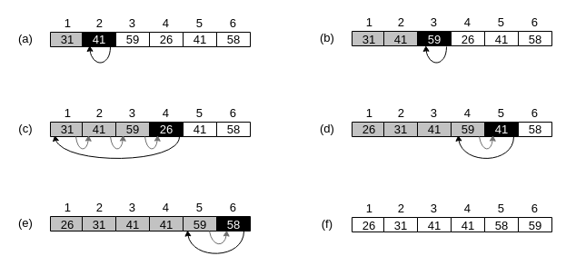

# Exercise 2.1-1
***
Using Figure 2.2 as a model, illustrate the operation of INSERTION-SORT on the array A = (31, 41, 59, 26, 41, 58).

### `Answer`
The operation of INSERTION-SORT algorithm on the array A = (31, 41, 59, 26, 41, 58) is depicted in the following figure.

    

