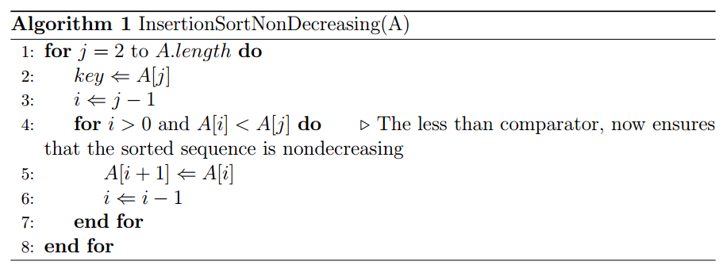
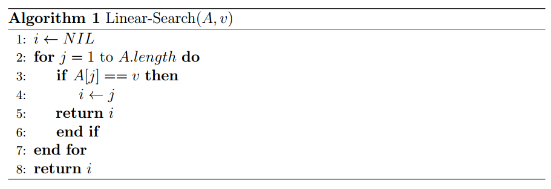
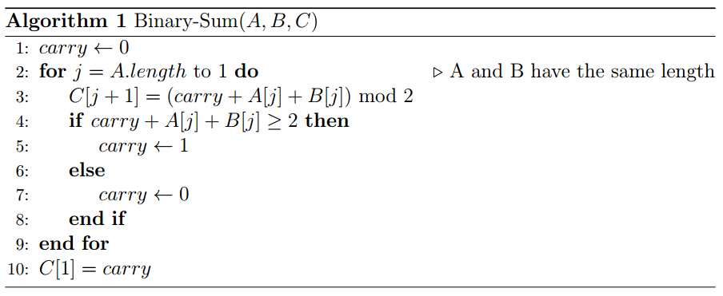

### Exercise 2.1-1
***
Using Figure 2.2 as a model, illustrate the operation of *INSERTION-SORT* on the array A = (31, 41, 59, 26, 41, 58).

### `Answer`
The operation of *INSERTION-SORT* algorithm on the array A = (31, 41, 59, 26, 41, 58) is depicted in the following figure.

    

### Exercise 2.1-2
***
Rewrite the *INSERTION-SORT* procedure to sort into nonincreasing instead of nondecreasing order.

### `Answer`
The *INSERTION-SORT* pseudocode procedure to sort in nondecreasing order is presented below. Also, there is a implemented version of this procedure in C++, which
can be seen <a href="https://github.com/nicowxd/CLRS/blob/master/Algorithms/insertionSortNonDecreasing.cpp">here</a>.

    

### Exercise 2.1-3
***
Consider the **_searching problem:_**

**Input:** A sequence of *n* numbers *A* = (a_1, a_2,..., a_n) and a value *v*.

**Output:** An index *i* such that *v* = *A*[*i*] or the special value *NIL* if *v* does not appear in *A*.

Write pseudocode for **_linear search_**, which scans through the sequence, looking for *v*. Using a loop invariant, prove that your algorithm is correct. Make sure that your loop invariant fulfills the three necessary properties.

### `Answer`

The *LINEAR-SEARCH* pseudocode is shown below. There is also a implemented version in C++, <a href="https://github.com/nicowxd/CLRS/blob/master/Algorithms/linearSearch.cpp">here</a>.

    

The loop invariant is:

    At the current index that we are evaluating, there is no index before (A[1..j-1], and A[0] = NIL) that is equal to v.

To prove this loop invariant we must show:

**Initialization:** Before the iteration of the first loop there is no number to be evaluated, therefore we must return *NIL*.

**Maintenance:** The for loop tests every index, increasing by one until the last element is evaluated. The return ensures that, if the condition (A[j] == v) holds, the *LINEAR-SEARCH* procedure is terminated and the current index is returned. Therefore, if we are testing the current index it means that the *LINEAR-SEARCH* didn't terminate and the condition didn't hold for any index before.

**Termination:** When the loop ends, by the same reason described in the **Maintenance** property, it means that we scanned the entire array A[1..n] (since j is equal to n + 1, the loop invariant holds) and there is no index j, such that A[j] == v.
This way, we should return *NIL* as stated by the problem.

### Exercise 2.1-4
***
Consider the problem of adding two *n*-bit binary integers, stored in two *n*-element arrays *A* and *B*. The sum of the two integers should be stored in binary form in an (*n* + 1)-element array *C*. State the problem formally and write pseudocode for adding the two integers.

### `Answer`

Problem statement: You are given two n-element arrays A and B. The given arrays represent a binary integer, where each element can assume either the number 1 or number 0. The problem is to perform the sum of these arrays in binary form and store in an array C, which will have (n + 1) elements.

**Input:** An array A = (a_1, a_2,...,a_n) and an array B = (b_1, b_2,...,b_n), where each element of these two array can assume either the digit 1 or 0.

**Output:** An array C = (c_1, c_2,...,c_n+1), which holds the binary sum performed by the arrays A and B.

The pseudocode to add the two arrays is given below.

    

