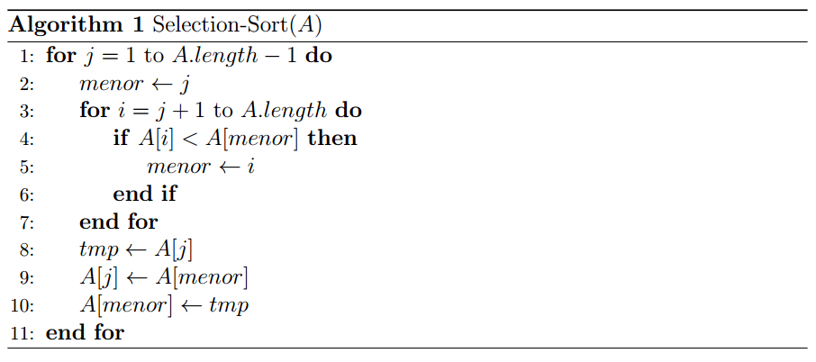

### Exercise 2.2-1
***
Express the function  in terms of Θ-notation.

### `Answer`
Θ()

### Exercise 2.2-2
***
Consider sorting *n* numbers stored in array *A* by first finding the smallest element of *A* and exchanging it with the element in *A*[1]. Then find the second smallest element of *A*, and exchange it with *A*[2]. Continue in this manner for the first *n* - 1 elements of *A*. Write pseudocode for this algorithm, which is known as **selection sort**. What loop invariant does this algorithm maintain? Why does it need to run for only the first *n* - 1 elements, rather than for all *n* elements? Give the best-case  and worst-case running times of selection sort in Θ-notation.

### `Answer`

The pseudocode is depicted below. There is also a C++ implemented version of the selection sort algorithm <a href="https://github.com/nicowxd/CLRS/blob/master/Algorithms/selectionSort.cpp">here</a>

    

The loop invariant is:
    At each iteration of the outer loop, we maintain the subarray A[1..j-1] with the first *j*-1 smallest elements, which ensures that the subarray A[1..j-1] is always sorted in increasing order.

Since it is guaranteed by the loop invariant that at the last for check, the first *n* - 1 elements are the smallest, this ensures that the last one remaining is indeed the largest. Therefore we don't need to scan the whole array, because the *n*-th element is in the right position.

The best case and the worst-case running times of the selection sort are Θ(). The proof is done below.
